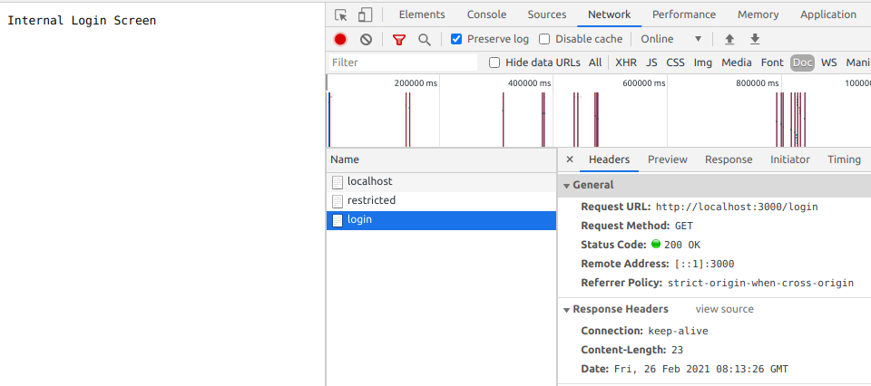

# Configuration / Setup

## /backend/backend.js

Contains the nodejs backend with the following endpoints

- /restricted is redirected to /login
- /login returns generic authentication page
- Any other request is replied with 200 and generic hello

Node listens internally to port 3000.

## /conf/httpd.conf

The apache httpd.conf file

## /vhosts/vhost-proxy.conf

The vhost-proxy.conf mentioned in the httpd.conf containing the virtual host configuration for
- proxy passing to backend
- applying transformation on the Location header "/login" -> "https://www.google.com"

Apache vhost listens internally to port 80

## docker-compose.yml

- backend is exposed at port 3000
- proxy is exposed at port 8080

# Example

## Direct access 

User accessing backend **DIRECTLY** at [http://localhost:3000/](http://localhost:3000/) 

### 1. User requests root host - gets back HTTP 200

### 2. User requests /restricted - gets back HTTP 302 with Location /login

### 3. User requests /login - gets reply HTTP 200 with login screen

## Proxy access 

User accessing backend **through the reverse proxy** at [http://localhost:8080/](http://localhost:8080/) 

### 1. User requests root host - gets back HTTP 200

### 2. User requests /restricted - gets back HTTP 302 with Location **ALTERED** to https://www.google.com

